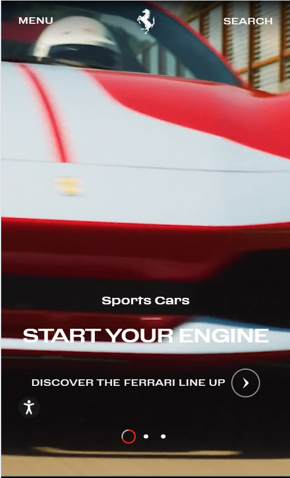
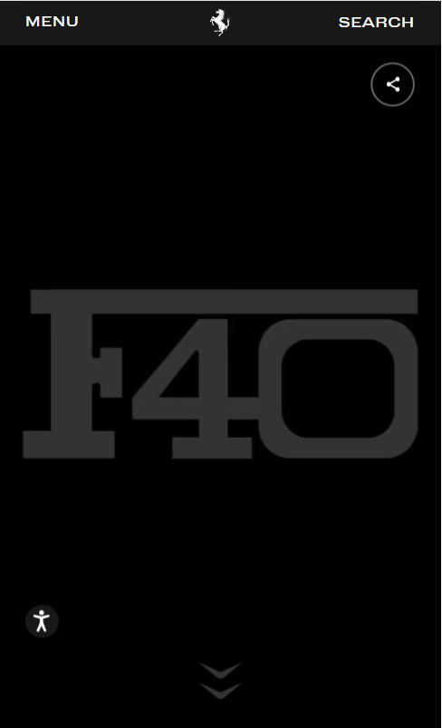
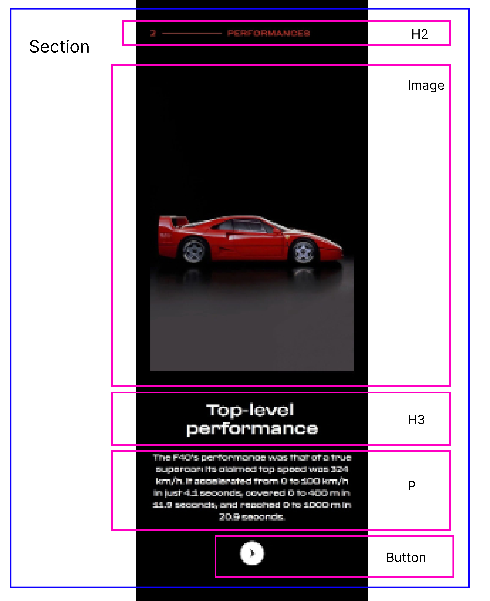

# Procesverslag
Markdown is een simpele manier om HTML te schrijven.  
Markdown cheat cheet: [Hulp bij het schrijven van Markdown](https://github.com/adam-p/markdown-here/wiki/Markdown-Cheatsheet).

Nb. De standaardstructuur en de spartaanse opmaak van de README.md zijn helemaal prima. Het gaat om de inhoud van je procesverslag. Besteedt de tijd voor pracht en praal aan je website.

Nb. Door *open* toe te voegen aan een *details* element kun je deze standaard open zetten. Fijn om dat steeds voor de relevante stuk(ken) te doen.

## Jij

  
uitwerken voor kick-off werkgroep

  ### Auteur:
  Ivy Schuurman

  #### Je startniveau:
  Rood

  #### Je focus:
  Mijn focus ligt op beide een beetje, maar vooral op de surface plane
 

## Je website

  
uitwerken voor kick-off werkgroep

  ### Je opdracht:
  De website van Ferrari, https://www.ferrari.com/en-NL 

  #### Screenshot(s) van de eerste pagina (small screen): 
  Home pagina 
  

  #### Screenshot(s) van de tweede pagina (small screen):
  Pagina waar wordt verteld over de Ferrari F40  
  
 

## Toegankelijkheidstest 1/2 (week 1)

  
uitwerken na test in 2e werkgroep

  ### Bevindingen
  Lijst met je bevindingen die in de test naar voren kwamen:
  Bij het gebruiken van de screen reader van Windows ging het helemaal fout. De screen reader kon alleen het menu opnoemen en de andere
  delen van de pagina's werden niet meegenomen. De site heeft wel een eigen screen reader die de gebruiker kan instellen. 

  Hier de foto's van de WCAG checklist (eerste test):
  " alt="Eerste pagina van de WCAG checklist"> 
  " alt="Tweede pagina van de WCAG checklist"> 
  " alt="Derde pagina van de WCAG checklist"> 
  " alt="Vierde pagina van de WCAG checklist"> 
  " alt="Vijfde pagina van de WCAG checklist"> 

## Breakdownschets (week 1)

  
uitwerken na afloop 3e werkgroep

  ### de hele pagina: 
  
  

  ### dynamisch deel (home pagina): 
  
  

  ### dynamisch deel (detail pagina): 
  

## Voortgang 1 (week 2)

  
uitwerken voor 1e voortgang

  ### Stand van zaken
  Het maken van de HTML van mijn website ging snel en makkelijk. Wel heb ik voor nu nog wat dingen weggelaten. Bijvoorbeeld de fotos van de gallerijen, 
  omdat ik nog niet weet of dit mijn micro interactie gaat worden en ik niet meer dan 40 fotos op één pagina wil waar ik dan niks mee doe. 

  ### Agenda voor meeting
  samen met je groepje opstellen

  |                |                    |                   |                  |
  | ---            | ---                | ---               | ---              |
  | Hoe geef je een| Wat doe ik met de  | Hoe maak ik het   |                  |
  | hamburger menu/| video delen van    | pop-up menu van   |                  |
  | gallerij/      | mijn website?      | de detail pagina? |                  |
  | carousel weer  |                    | detail pagina? Hoe|                  | 
  | in HTML?       |                    | zet ik dit in de  |                  |
  |                |                    | HTML?             |                  |
  | ...            | ...                | ...               | ...              |

  ### Verslag van meeting
  hier na afloop snel de uitkomsten van de meeting vastleggen

  - Maak gebruik van articles voor carousels
  - Detail element kan gebruikt worden voor het uitklappen van de footer -> is alleen niet geweldig voor vormgeving
  - Focus eerst op basis pagina voor HTML en CSS -> kijk daarna naar het klikbaar maken van buttons, etc. 
  - Snap je iets niet? probeer het dan gewoon en kijk bij het volgende feedback moment hoe het verbeterd kan worden

## Voortgang 2 (week 3)

  
uitwerken voor 2e voortgang

  ### Stand van zaken
  De CSS gaat een beetje langzaam, langzamer dan ik zou willen in iedergeval. Het is niet altijd even makkelijk voor mij om uit te vogelen welke properies ik 
  moet gebruiken en bij welk element ik deze dan moet toepassen. Het lukt mij wel, maar ik heb ook zeker heel wat stukken waar ik toch vast loop.
  (foto's volgen nog)

  ### Agenda voor meeting
  samen met je groepje opstellen

  |                |                    |                 |                   |
  | ---            | ---                | ---             | ---               |
  | Hoe maak ik de | Hoe haal ik de     | Ik heb hulp     | Ik heb hulp nodig |
  | buttons in de  | witte strepen op   | nodig bij het   | bij het maken van |
  | footer na?     | website weg?       | maken van       | de header (menu)  |  
  |                |                    | buttons         |                   |
  | ...            | ...                | ...             | ...               |

  ### Verslag van meeting
  hier na afloop snel de uitkomsten van de meeting vastleggen

  - Voor de buttons in de footer kijk of je gebruik kan maken van 
, <before> en <after>
    -> <before> voor de icons
    -> <after> voor het plusje
  - Voor de nav in de footer kan je flex en flex-wrap gebruiken
  - Voor het weghalen van de witte strepen moet je de background-color van de gehele pagina aanpassen
  - Img folder moet nog geupdate worden op github, want je ziet nu niet de namen van de afbeeldingen

## Toegankelijkheidstest 2/2 (week 4)

  
uitwerken na test in 9e werkgroep

  ### Bevindingen
  Lijst met je bevindingen die in de test naar voren kwamen (geef ook aan wat er verbeterd is):

## Voortgang 3 (week 4)

  
uitwerken voor 3e voortgang

  ### Stand van zaken
  hier dit ging goed & dit was lastig (neem ook screenshots op van delen van je website en code)

  ### Agenda voor meeting
  samen met je groepje opstellen

  | student 1      | student 2          | student 3    | student 4        |
  | ---            | ---                | ---          | ---              |
  | dit bespreken  | en dit             | en ik dit    | en dan ik dat    |
  | en dat ook nog | dit als er tijd is | nog een punt | dit wil ik zeker |
  | ...            | ...                | ...          | ...              |

  ### Verslag van meeting
  hier na afloop snel de uitkomsten van de meeting vastleggen

  - punt 1
  - punt 2
  - nog een punt
  - ...

## Eindgesprek (week 5)

  
uitwerken voor eindgesprek

  ### Je uitkomst - karakteristiek screenshots:
  

  ### Dit ging goed/Heb ik geleerd: 
  Korte omschrijving met plaatjes

  

  ### Dit was lastig/Is niet gelukt:
  Korte omschrijving met plaatjes

  

## Bronnenlijst

  
continu bijhouden terwijl je werkt

  Nb. Wees specifiek ('css-tricks' als bron is bijv. niet specifiek genoeg). 
  Nb. ChatGpT en andere AI horen er ook bij.
  Nb. Vermeld de bronnen ook in je code.

  1. bron 1
  2. bron 2
  3. ...

